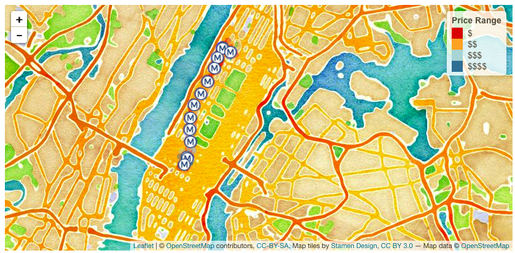

# Trip Planner Shiny App

### Project Description

ShinyApp Link: https://gongfan.shinyapps.io/planr/
<br>(It may take some time to load streaming data)



In this project, we develop an *Exploratory Data Analysis and Visualization* shiny app using Google Maps, Yelp, and New York MTA data.

The **learning goals** for this project is:

- business intelligence for data science
- data cleaning
- data visualization
- systems development/design life cycle
- shiny app/shiny server

+ **Project summary**: Plan.R is an interactive, real time Shiny app which plans a route using Google Maps and finds highly rated businesses from Yelp that are along the route.


Following [suggestions](http://nicercode.github.io/blog/2013-04-05-projects/) by [RICH FITZJOHN](http://nicercode.github.io/about/#Team) (@richfitz). This folder is orgarnized as follows.

```
proj/
├── app/
├── lib/
├── data/
├── doc/
└── output/
```

Please see each subfolder for a README file.

